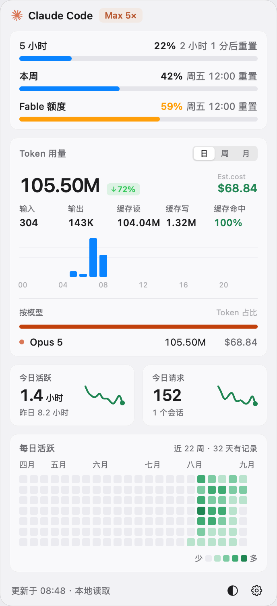
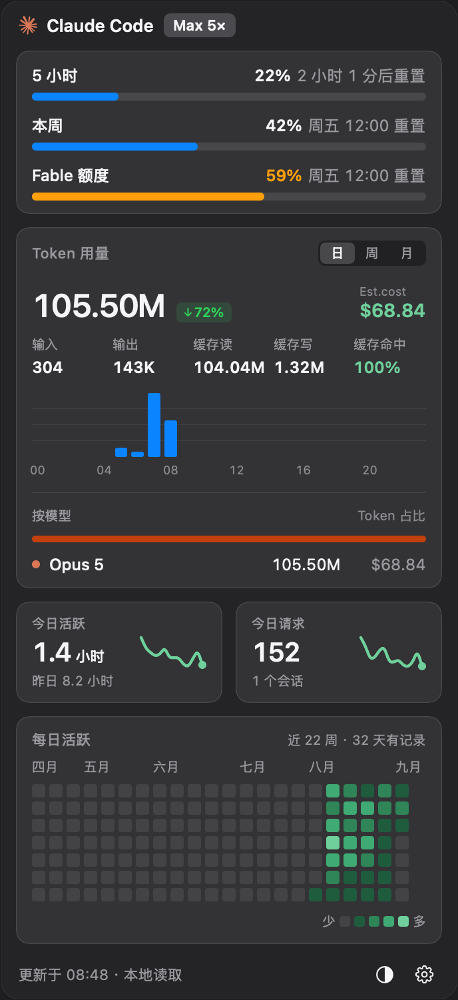
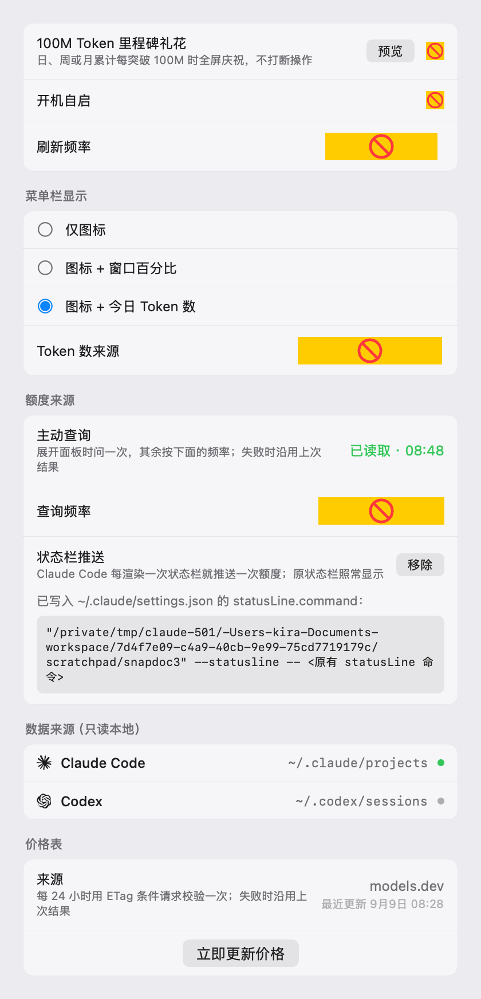

# Clio

macOS 菜单栏里的 Claude Code / Codex 用量面板：额度还剩多少、今天烧了多少 Token、花了多少钱，点一下菜单栏就能看到。

名字取自记述历史的缪斯克利俄——这个工具做的就是把本地会话日志读成一本账。

<p align="center">
  
  
</p>

## 功能

### 额度

- **5 小时**、**本周**、**按模型**（如 Fable）三个窗口的真实利用率与重置时间。
- 利用率过半转橙、超过八成转红，菜单栏的用量环同步变色。
- 悬停进度条给出按当前速率的耗尽推算，例如「按当前速率约 1 小时 40 分后耗尽」；在重置前用不完时直说用不完，不给一个比重置时间还远的数字。
- 百分比背后对应多少 Token 从不推断——日志里被拒绝的窗口区间在 53M 到 206M 之间，不是一个固定值。

### 用量

- 日 / 周 / 月三个粒度，各自的 Token 总量、环比、花费估算。
- 输入、输出、缓存读、缓存写，以及缓存命中率。
- 柱状图按小时（日）、按星期（周）、按日期（月）分布，悬停显示该柱的具体数值。
- 按模型的占比条与逐行明细，含各自的 Token 与花费。

### 活跃度

- **今日活跃**：相邻两次回复的间隔求和，每段最多计 5 分钟；副行是昨日同口径。
- **今日请求**：今天的回复条数与去重后的会话数。
- 两张卡片各带一条最近 14 天的折线。
- **每日活跃**热力图，近 22 周，悬停显示某天的日期与用量。

### 菜单栏

<p align="center"></p>

三种显示方式：仅图标、图标 + 窗口百分比、图标 + 今日 Token 数。

### 里程碑礼花

<p align="center"></p>

日、周或月累计每突破 100M Token 时全屏庆祝，约 5 秒后自动消失，透明且可点穿，不打断手上的操作。设置里可预览、可关闭。

### 其它

- 深色 / 浅色 / 跟随系统。
- 价格表取自 [models.dev](https://models.dev)，每 24 小时用 ETag 条件请求校验一次，失败时沿用上次结果。

## 额度数据从哪来

<p align="center"></p>

两条来源，可同时生效，合并时取较新的一份。

**主动查询**（默认，无需配置）。向 Claude Code 发一条 `get_usage` 控制请求：

```
claude --print --verbose --input-format stream-json --output-format stream-json
{"type":"control_request","request_id":"clio","request":{"subtype":"get_usage","skip_behaviors":true}}
```

用已有的登录，不消耗 Token，不写会话记录。展开面板时问一次，其余按设置里的查询频率（默认 30 分钟）。这是唯一能拿到**按模型窗口**的途径。

需要注意的是，Claude Code 把这个请求标为实验性，响应结构可能变化。真变了的话额度会退回只显示窗口内的 Token 数，其余功能不受影响。

**状态栏推送**（可选）。设置里按一下「接入」，把 `~/.claude/settings.json` 的 `statusLine.command` 改写成：

```
"/Applications/Clio.app/Contents/MacOS/Clio" --statusline -- <原有 statusLine 命令>
```

原命令原样保留在后面，状态栏照常渲染。此后 Claude Code 每渲染一次状态栏就推送一次额度，用它时几乎实时。改写前会备份成 `settings.json.bak-clio-<时间戳>`，按「移除」可还原。这条通道不含按模型窗口。

## 数据与隐私

- 只读本地日志：`~/.claude/projects/**/*.jsonl` 与 `~/.codex/sessions`，从不写入。
- 应用自身发出的网络请求只有一个：向 models.dev 取价格表。额度请求是 Claude Code 自己发的。
- 用量数据不离开本机。

## 安装

从 `build/Clio-1.0.0.dmg` 打开，把 Clio 拖进 Applications。

安装包只做了 ad-hoc 签名，首次打开会被 Gatekeeper 拦下。右键点图标选「打开」，或者：

```bash
xattr -dr com.apple.quarantine /Applications/Clio.app
```

应用不占用程序坞，启动后只在菜单栏出现。

## 构建

```bash
Scripts/build.sh      # 出 build/Clio.app
Scripts/package.sh    # 出 build/Clio-<版本>.dmg
```

编译走 `swiftc` 直接调用而不是 `swift build`：只装了 Command Line Tools 的机器上，SwiftPM 的清单编译会失败。`Package.swift` 保留给装有完整 Xcode 的机器。

两个开发入口，用来在不点菜单栏的情况下检查读取与排版：

```bash
Clio --dump             # 把解析出的仪表盘打印成文本
Clio --snapshot <目录>   # 把每个界面渲染成 PNG
```

## 已知限制

- 热力图最远只能到 Claude Code 保留的日志为止（默认 30 天，由 `cleanupPeriodDays` 控制），更早的转录文件已被它清理，本地无从恢复。
- 设计稿里的「剩余重置次数」没有任何本地来源，因此不显示。
- 今日活跃是推算值：日志只记录每次回复的时间点，没有会话时长。
- Codex 的日志不记会话标识，那一侧的会话数会算作一个。
